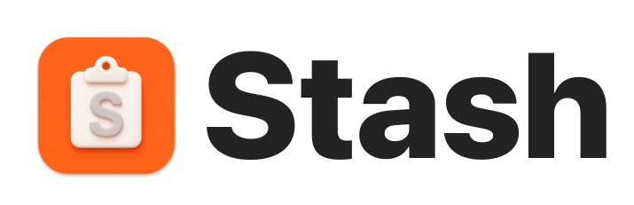

<div align="center">

<picture>
  <source media="(prefers-color-scheme: dark)" srcset="docs/assets/wordmark-dark.png">
  
</picture>

### Everything you copy, one `⌥V` away.

A clipboard journal for macOS. Text, images and files stay for a day, and come back right where your cursor is.

<a href="https://github.com/KiraMurano/stash/releases/latest"></a>

<a href="https://github.com/KiraMurano/stash/releases/latest"></a>  

<br>

<picture>
  <source media="(prefers-color-scheme: dark)" srcset="docs/assets/hero-dark.svg">
  
</picture>

</div>

## Open

Press `⌥V`. The journal opens under the text cursor of the app you are typing in — below the caret, or above it when there is no room. Where an app keeps its caret to itself, it opens next to the focused field instead.

<p align="center"><picture>
  <source media="(prefers-color-scheme: dark)" srcset="docs/assets/open-dark.svg">
  
</picture></p>

## Paste

Double-click a clip and it lands where your cursor is. The orange button does the same; the one beside it only puts the clip back on the pasteboard.

<p align="center"><picture>
  <source media="(prefers-color-scheme: dark)" srcset="docs/assets/paste-dark.svg">
  
</picture></p>

## Keys

`↑` and `↓` choose, `Return` pastes, `Esc` closes. The journal never takes the keyboard — everything else you type keeps going to the app underneath, and a click anywhere outside closes it.

<p align="center"><picture>
  <source media="(prefers-color-scheme: dark)" srcset="docs/assets/keys-dark.svg">
  
</picture></p>

## Pin

Stash keeps the last 20 clips for a day. Pin the ones that matter and they stay at the top of the list until you unpin them.

<p align="center"><picture>
  <source media="(prefers-color-scheme: dark)" srcset="docs/assets/pin-dark.svg">
  
</picture></p>

## The rest of it

- **Text, images, files.** Whatever the pasteboard holds. Clicking an image opens it in Preview; text can be edited before it goes anywhere.
- **Menu bar only.** No Dock icon, no window in the way. Frosted glass with orange accents.
- **A short tour** on the first launch — five slides in a window of its own. `How to Use Stash?` plays it again.
- **Themes and languages.** System, Light, Dark and the Stash themes; English and Русский.
- **Updates in place.** A new release lights a dot on the menu bar icon, and one click replaces the app and relaunches it.
- **Stays on your Mac.** History is stored locally in `~/Library/Application Support/BufferJournal`. Nothing is sent anywhere.

<details>
<summary>Every switch and every corner of the journal</summary>

<br>

**In the list.** Hover a clip and the orange return button pastes it; the buttons beside it pin and delete. The number by the wordmark counts what is kept. The filter above the list narrows it to text, images or files.

**In the preview.** Text can be edited before it goes anywhere, an image opens in Preview, and a file opens in its own app. `Size` says how much there is of it, and a clip that is still on the pasteboard is marked `in clipboard`. Drag the divider to give the list more room.

**In the menu bar menu.**

| | |
|---|---|
| `Open at the Cursor` | Opens the journal at the caret instead of where you last left it. On by default. |
| `Close After Selection` | Closes the journal once a clip has been pasted or copied. |
| `Intercept Keys` | Lets the journal have `↑ ↓ Return Esc`. Switch it off to leave those keys to your app and work the journal with the mouse. On by default. |
| `Theme` | System, Light, Dark, and Stash Auto / Light / Dark, which trade the translucent accents for solid ones. |
| `Language` | System, English, Русский. |
| `How to Use Stash?` | Plays the tour again. |
| `About Stash` | A window under the menu bar icon with the version, the studio's wordmark set in Booker Display — its letters change their form on their own — and a link here. |
| `Check for Updates…` | Becomes `Update to 1.27` when there is something to install. `Check for Updates Automatically` turns the daily check off; the item still works by hand. |
| `Clear History` | Removes the unpinned clips. The pinned ones stay. |

</details>

## Install

1. [Download the DMG](https://github.com/KiraMurano/stash/releases/latest), open it, drag **Stash** onto Applications.
2. macOS blocks the first launch: click Done, then open System Settings → Privacy & Security, scroll down and click **Open Anyway** next to Stash.
3. Stash pastes by pressing `⌘V` for you, which needs Accessibility access. It asks on its own, with a button that opens the right settings pane.

<details>
<summary>Why the first launch is blocked, and what to do about it</summary>

<br>

Stash is not notarized, so Gatekeeper stops the first launch. Instead of the Settings trip you can also clear the quarantine flag by hand:

```bash
xattr -dr com.apple.quarantine /Applications/Stash.app
```

Stash is signed with a self-signed certificate, so its identity stays the same from release to release and the Accessibility permission survives an update. The one exception is the release that introduced updating: the signature changed with it, so that permission has to be granted once more — remove the old Stash entry from the list with − and click Open Settings again.

</details>

## Build

```bash
Scripts/build_app.sh
```

The bundle lands in `.build/Stash.app`, universal for Apple silicon and Intel. Signing, versioning and the release flow live in [docs/DEVELOPMENT.md](docs/DEVELOPMENT.md).

<div align="center">
<br>
Made in <a href="https://ozero.digital">ozero.digital</a>
</div>
